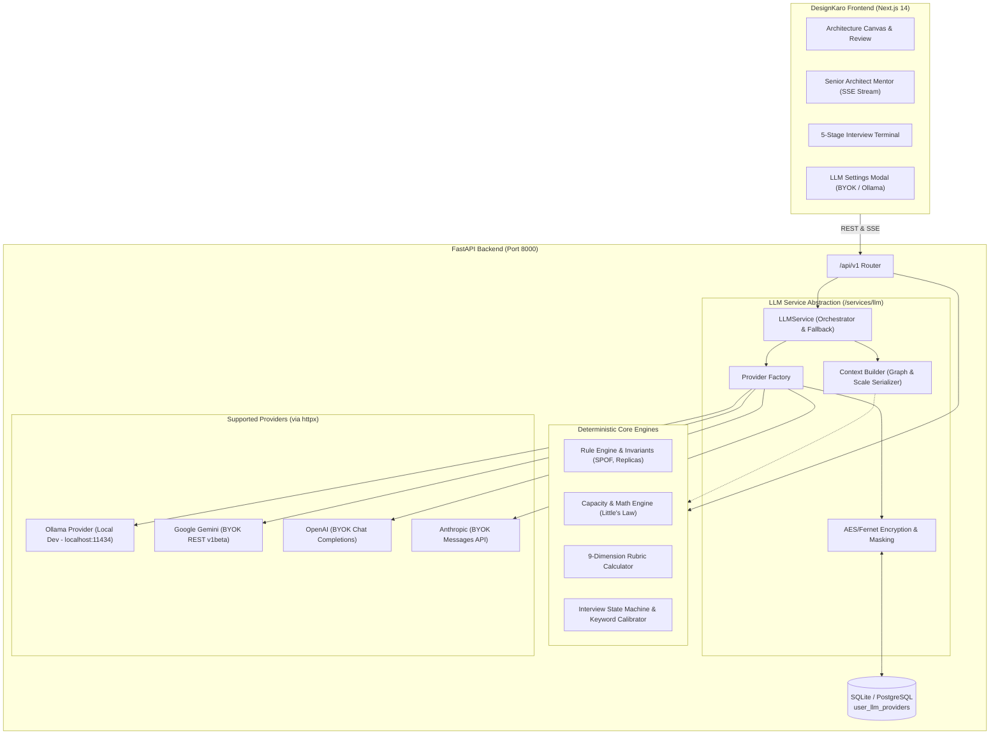
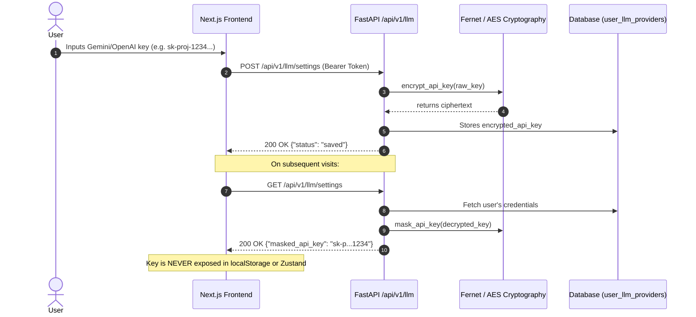
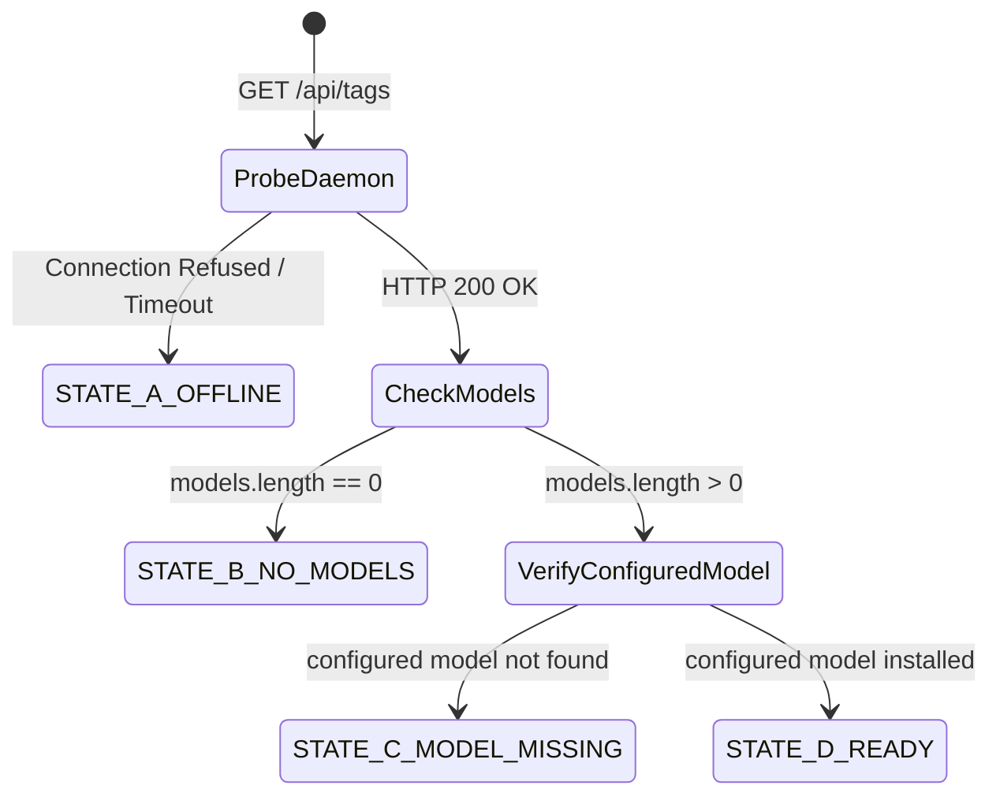
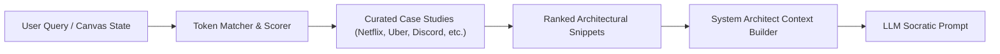

# DesignKaro Real LLM Architecture & BYOK Specification

> *"Socho. Design Karo. Scale Karo."*

## 1. Executive Architecture Summary

DesignKaro implements a **Production-Quality, Provider-Agnostic Hybrid LLM Architecture**.

The system pairs **deterministic invariant engines** (graph topological checks, Little's Law capacity derivations, 9-dimension scoring formulas, and 5-stage interview state machines) with **real LLM reasoning** (Socratic guidance, conversational interview turns, and executive summaries).



---

## 2. Core Architectural Principles

### 2.1 Provider Agnosticism
Every provider implements `BaseLLMProvider` (`backend/app/services/llm/interface.py`) with uniform, normalized contracts:
- `generate(request: LLMRequest) -> LLMResponse`
- `stream(request: LLMRequest) -> AsyncIterator[LLMStreamChunk]`
- `health_check() -> ProviderHealthStatus`

All external provider calls use asynchronous non-blocking HTTP (`httpx.AsyncClient`). There are **no heavy vendor SDKs** or unneeded in-memory deep learning frameworks loaded into FastAPI.

### 2.2 Development vs Production Separation
| Environment | Active Runtime | Credentials Required | Target Hardware / SLA |
| :--- | :--- | :--- | :--- |
| **Development** | **Local Ollama Only** | None | Optimized for RTX 4050 (6GB VRAM) via `llama3.2:3b` (~2.0GB VRAM) or `qwen2.5:3b`. Zero external network calls. |
| **Production** | **User Bring-Your-Own-Key (BYOK)** | Google Gemini / OpenAI / Anthropic API Key | Cloud high-concurrency reasoning. Keys stored server-side encrypted per user. |

### 2.3 Strict Deterministic Engine Integrity
LLMs **never override deterministic math or rules**:
1. **Rule Engine**: SPOF checks, missing load balancers, direct client-database access, and circular dependency checks remain 100% deterministic boolean evaluations.
2. **Review Engine**: All 9 dimension scores (0–100) and overall grades remain strictly calculated by mathematical rules. The LLM enriches the executive narrative and contextual recommendations.
3. **Interview Engine**: 5-stage progression, score cards, and hiring signals are tracked deterministically. The LLM conducts organic conversational probing.

### 2.4 Resilient Graceful Degradation
If Ollama is not running, or an external BYOK key fails or rate-limits:
- **DesignKaro never crashes.**
- The service catches the exception and immediately yields the deterministic heuristic fallback response with `fallback_used: true` and provider badge `heuristic-engine`.

---

## 3. Security & BYOK Key Management



1. **Encryption at Rest**: User BYOK API keys are encrypted using Fernet (AES-128-CBC + HMAC-SHA256) via `LLM_ENCRYPTION_KEY` or derived salt.
2. **Never Stored in Client**: Plaintext API keys are never stored in localStorage, cookies, or client-side Zustand state.
3. **Never Returned via GET**: The `GET /api/v1/llm/settings` endpoint only returns masked keys (e.g. `sk-p...1234`).
4. **No Plaintext Logging**: Plaintext keys are excluded from all server logs and telemetry.

---

## 4. Local Development Setup (Ollama)

### 4.1 Prerequisites
Download and install [Ollama](https://ollama.com/).

### 4.2 Start Ollama Daemon
```bash
ollama serve
```

### 4.3 Pull Recommended Model (RTX 4050 6GB VRAM)
```bash
# Recommended default (compact, 3B params, ~2.0 GB VRAM)
ollama pull llama3.2:3b

# Alternative high-reasoning 3B model
ollama pull qwen2.5:3b
```

### 4.4 Environment Configuration (`.env`)
```bash
LLM_PROVIDER="ollama"
OLLAMA_BASE_URL="http://localhost:11434"
OLLAMA_MODEL="llama3.2:3b"
```

---

## 5. API Reference

| Endpoint | Method | Auth | Description |
| :--- | :--- | :--- | :--- |
| `/api/v1/llm/providers` | `GET` | Optional | Lists supported providers with real-time Ollama daemon probe. |
| `/api/v1/llm/diagnostics` | `GET` | Optional | Deep system diagnostics: hardware (GPU/VRAM/RAM/CPU), Ollama state, model pull guidance. |
| `/api/v1/llm/settings` | `GET` | Required | Retrieves authenticated user's active provider and masked keys. |
| `/api/v1/llm/settings` | `POST` | Required | Saves and encrypts user's BYOK provider credentials. |
| `/api/v1/llm/settings/{provider}` | `DELETE` | Required | Removes stored credentials for a provider. |
| `/api/v1/llm/test` | `POST` | Optional | Tests connectivity with an LLM provider (rate limited to 15 req/min). |
| `/api/v1/mentor/chat/stream` | `POST` | Optional | SSE real-time streaming endpoint for Socratic mentoring. |

---

## 6. Ollama Health State Machine

The Ollama provider implements a 4-state deterministic health inspection workflow:



| State | Enum Name | Description | Next Developer Action |
| :--- | :--- | :--- | :--- |
| **State A** | `OFFLINE` | Daemon is not responding on `http://localhost:11434` | Start daemon via `ollama serve` |
| **State B** | `DAEMON_RUNNING_NO_MODEL` | Daemon is active, but 0 models are installed | Run `ollama pull llama3.2:3b` |
| **State C** | `MODEL_NOT_FOUND` | Daemon is active, other models installed, but configured model missing | Run `ollama pull llama3.2:3b` |
| **State D** | `READY` | Daemon active and configured model verified ready | Ready for zero-cost local inference |

---

## 7. RAG (Retrieval-Augmented Generation) Knowledge Integration

DesignKaro features a curated repository of real-world system design case studies and architectural precedents in `backend/app/api/v1/endpoints/knowledge.py`.



When users ask questions or request advice in the AI Mentor Drawer:
1. `retrieve_relevant_rag_snippets(user_message)` scores case-study titles, tags, and summaries against query tokens.
2. The top relevant precedents (e.g. Netflix Open Connect CDN caching, Uber geohashing, Discord Cassandra-to-ScyllaDB migrations) are injected into the architect context block.
3. The LLM references real production trade-offs in its Socratic guidance.

---

## 8. Rate Limiting Protection

To prevent runaway testing costs or provider quota exhaustion:
- The `POST /api/v1/llm/test` endpoint is guarded by a sliding-window rate limiter (`EndpointRateLimiter`).
- Allows up to **15 connection tests per minute** per user ID or client IP.
- Excess calls return a structured failure response (`success: false, error_message: "Rate limit exceeded..."`) without throwing unhandled exceptions in frontend modals.

---

## 9. Adding a New LLM Provider (Extensibility)

To add a new provider (e.g., Mistral, Cohere, DeepSeek):
1. Subclass `CommonLLMProvider` in `backend/app/services/llm/providers/<provider_name>_provider.py`.
2. Implement `generate()`, `stream()`, and `health_check()`.
3. Register the provider in `SUPPORTED_PROVIDERS` and `ProviderRegistry` in `backend/app/services/llm/providers/factory.py`.
4. The provider immediately becomes available in the frontend BYOK selector modal without changes to core deterministic engines.

---

## 10. Automated Verification & Quality Gates

Run the full automated test suite:
```powershell
$env:PYTHONPATH="."
.\designkaro_env\python.exe -m pytest backend/tests -v
```
All 73 tests verify:
- Cryptographic roundtrips and tamper resistance
- Api key masking sanitization
- Provider abstraction network mock handling
- Fallback to deterministic heuristics on provider failure
- Server-Sent Event (SSE) token streaming
- 4-state health inspection
- Environment isolation (Ollama prohibited in production)
- RAG retrieval and context injection
- Test endpoint sliding-window rate limiting
- User BYOK settings encrypted CRUD operations
